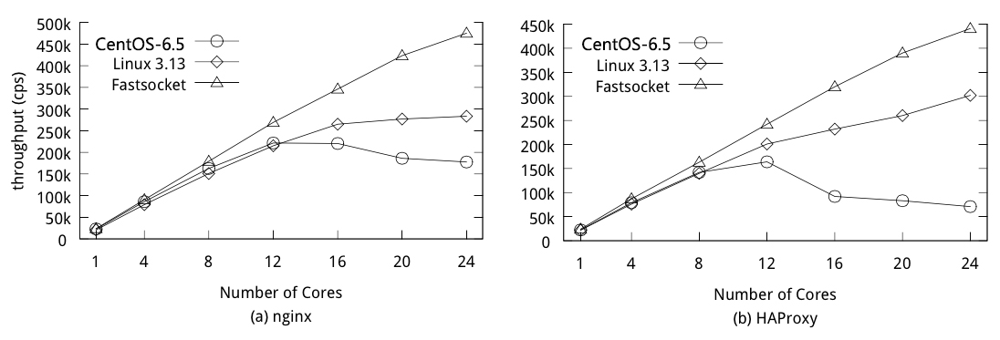
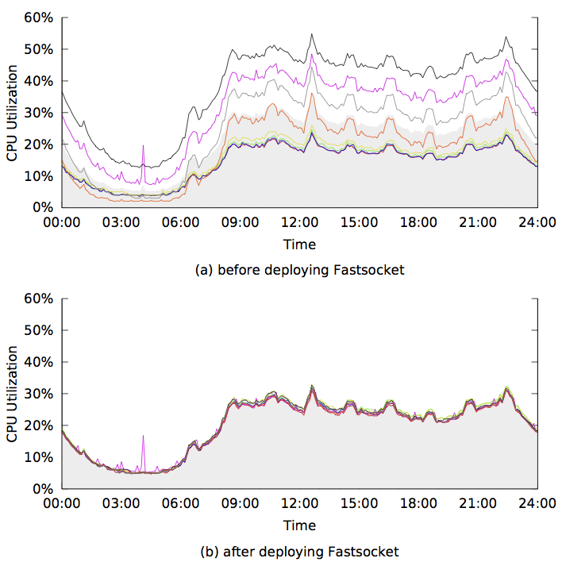

 README for FASTSOCKET
========================================================================

## TABLE OF CONTENT ##
* [Introduction](#introduction)
* [Installation](#installation)
  * [Requisites](requisites)
  * [Get the source](get-the-source)
  * [Kernel](#kernel)
    * [Install from RPM packages](#install-from-rpm-packages)
	* [Install from source](#install-from-source)
  * [User-level library](#user-level-library)
* [System Configuration](#system-configuration)
* [Usage](#usage)
* [Running demo](#running-demo)
  * [Build Demo](#build-demo)
  * [Simple Web Mode](#simple-web-mode)
  * [Proxy Mode](#proxy-mode)
* [Evaluation](#evaluation)

## INTRODUCTION ##

Fastsocket is a scalable TCP socket implementation that
  * achieves locality of both passive and active connections,
  * converts both listen and established socket tables into per-cpu data
    structures,
  * benefits applications without introducing modifications to the apps, and
  * keeps all kinds of monitoring / tuning tools available out-of-the-box.

According to our evaluations, Fastsocket increases throughput of nginx and
HAProxy (measured by connections per second) by 65% and 46% on a 24-core
machine, compared to Linux 3.13. Fastsocket has also been deployed to Sina
production systems for balancing system loads and reducing CPU utilization.

## INSTALLATION ##

### REQUISITES ###

10 Gbe controllers are recommended in order to enjoy the benefits of Fastsocket,
though Fastsocket can also work on 1Gbe controllers.  Here is a list of
tested NICs (Network Interface Controller):

- igb
  - Intel Corporation 82576 Gigabit Network Connection (rev 01)
  - Intel Corporation I350 Gigabit Network Connection (rev 01)
- ixgbe
  - Intel Corporation 82599ES 10-Gigabit SFI/SFP+ Network Connection (rev 01)
  - Intel Corporation 82599EB 10-Gigabit SFI/SFP+ Network Connection (rev 01)
- bnx2
  - Broadcom Corporation NetXtreme II BCM5708 Gigabit Ethernet (rev 12)
  - Broadcom Corporation NetXtreme II BCM5709 Gigabit Ethernet (rev 20)
- tg3
  - Broadcom Corporation NetXtreme BCM5720 Gigabit Ethernet PCIe
  - Broadcom Corporation NetXtreme BCM5761 Gigabit Ethernet PCIe (rev 10)

All packages required can be installed by the following command:

	[root@localhost ~]# yum install gcc make ncurses ncurses-devel perl ethtool iproute net-tools iptables

Ab is required on machines act as clients:

	[root@localhost ~]# yum install httpd-tools

### GET THE SOURCE ###

The source code is available at https://github.com/fastos/fastsocket.git. Clone the repository by:

	[root@localhost ~]# git clone https://github.com/fastos/fastsocket.git

Here's a brief introduction to the directories in the repository.

* **kernel** - the kernel source code customized for fastsocket, based on CentOS
  2.6.32-431.17.1
* **library** - the library to enable fastsocket in user space
* **scripts** - configuration scripts
* **demo** - source code of a demo server

### KERNEL ###

#### INSTALL FROM RPM PACKAGES ####

For those who do not want to bother with the source codes, RPM packages are
provided for RHEL, CentOS and Fedora. Packages in deb format are not yet
available.

Download the files:

	[root@localhost ~]# wget http://xxx.xxx.xxx/xxx.tgz
	[root@localhost ~]# tar xf xxx.tgz

Install the RPM packages:

	[root@localhost ~]# rpm --force -ivh \
	> kernel-2.6.32-431.17.1.el6.x86_64.rpm \
	> kernel-firmware-2.6.32-431.17.1.el6.x86_64.rpm \
	> kernel-devel-2.6.32-431.17.1.el6.x86_64.rpm

Reboot and enter the new kernel:

	[root@localhost ~]# reboot

#### INSTALL FROM SOURCE ####

Developers can easily get the source codes and build fastsocket as prefered. The
following commands will build and install the kernel after Fastsocket repository
is downloaded from git.

	[root@localhost ~]# cd fastsocket/kernel
	[root@localhost kernel]# make localmodconfig
	[root@localhost kernel]# make
	[root@localhost kernel]# make modules_install
	[root@localhost kernel]# make install

Then you can reboot and enter the new kernel:

	[root@localhost kernel]# reboot

### USER-LEVEL LIBRARY ###

To compile the library, enter the library directory, and make:

	[root@localhost fastsocket]# cd library
	[root@localhost library]# make

After that, a file named libsocket.so is created in the same directory.

## SYSTEM CONFIGURATION ##

After booting into the kernel with fastsocket, you can probe the fastsocket
module into the kernel:

	[root@localhost ~]# modprobe fastsocket

To check if the module is loaded successfully, run

	[root@localhost ~]# lsmod | grep fastsocket

and make sure you get a line like the following

    fastsocket             23145  0

Set up IP addresses as you like, and a script in the repository will take care
of the remaining configurations:

	[root@localhost ~]# cd fastsocket
	[root@localhost fastsocket]# scripts/nic.sh -i eth0

*eth0* is the interface to be used and should be changed according to your
system configuration (refer to *ifconfig* for details). The scripts will
automatically check system and NIC parameters and configures various
features. Please make sure you see the following line at the end of the output:

    Fastsocket has successfully configured eth0

A higher limit of opened files per process is sometimes needed for stress testing:

	[root@localhost fastsocket]# ulimit -n 65536

## USAGE ##

Fastsocket is enabled by preloading a shared library when launching an
application. For example, ngnix can be started with Fastsocket by:

	[root@localhost fastsocket]# cd library
	[root@localhost library]# LD_PRELOAD=./libsocket.so nginx

Without the preloaded library, applications can run as if they are on the
original kernel.

	[root@localhost ~]# nginx

## RUNNING DEMO ##

The demo server can act as a simple web server or a proxy server. The former
needs two hosts and the latter three. For more details on the demo server
please refer to [Demo Server](http://github.com).

> Note: It is recommended to install Fastsocket on all machines involved in the
> tests, no matter they act as clients or servers, to avoid potential
> bottlenecks in the original kernel.

### BUILD DEMO ###

Demo can be built by the following command:

>	`[root@localhost fastsocket]# cd demo && make`

### SIMPLE WEB MODE ###

In the simple web mode, two hosts are needed:

- Host A acts as a work load producer
- Host B acts as a simple web server

Assume your IP addresses are configured in the following way:

	+--------------------+     +--------------------+
	|       Host A       |     |       Host B       |
	|                    |     |                    |
	|        10.0.0.1/24 |-----| 10.0.0.2/24        |
	|                    |     |                    |
	+--------------------+     +--------------------+

To run the demo, here are the steps on each of two hosts.

**Host A**:

> - Install and run the workload, e.g.
>
>	`[root@localhost ~]# ab -n 1000000 -c 100 http://10.0.0.2:80/`
>
> - To saturate the server, multiple ab instances are required, which can be
>   launched by the following command (12 instances in the example).
>
>   `[root@localhost ~]# N=12; for i in $(seq 1 N); do ab -n 1000000 -c 100 http://10.0.0.2:80/ > /dev/null 2>&1; done`

**Host B**:

> - Run the demo server with fastsocket
>
>	`[root@localhost demo]# LD_PRELOAD=../library/libsocket.so ./server -w ## -a 10.0.0.2:80`
>
>   where ## is the number of workers (typically equal to the number of processers on your machine)

### PROXY MODE ###

In the proxy mode, three hosts are needed:

- Host A acts as a work load producer
- Host B acts as a proxy server
- Host C acts as a backend server

Assume your IP addresses are configured in the following way:

	+--------------------+     +--------------------+     +--------------------+
	|       Host A       |     |       Host B       |     |       Host C       |
	|                    |     |                    |     |                    |
	|    10.0.0.1/24     |     |    10.0.0.2/24     |     |     10.0.0.3/24    |
	+---------+----------+     +---------+----------+     +----------+---------+
              |                          |                           |
	+---------+--------------------------+---------------------------+---------+
	|                                 switch                                   |
	+--------------------------------------------------------------------------+

To run the demo, here are the steps on each of three hosts.

**Host A**:

> - Run the work load, here with 12 tasks:
>
>	`[root@localhost ~]# ab -n 1000000 -c 100 http://10.0.0.2:96/`
>
> - To saturate the server, multiple ab instances are required, which can be
>   launched by the following command (12 instances in the example).
>
>   `[root@localhost ~]# N=12; for i in $(seq 1 N); do ab -n 1000000 -c 100 http://10.0.0.2:96/ > /dev/null 2>&1; done`

**Host B**:

> - Run the demo server with fastsocket in proxy mode
>
>	`[root@localhost demo]# LD_PRELOAD=../library/libsocket.so ./server -w ## -a 10.0.0.2:96 -x 10.0.0.3:80`
>

**Host C**:

> - Run the demo server with fastsocket in simple web mode
>
>	`[root@localhost demo]# LD_PRELOAD=../library/libsocket.so ./server -w ## -a 10.0.0.3:80`
>

## EVALUATION ##

For Nginx,

- HTTP Keep-alive is disabled on Nginx for a short connection test.
- HTTP load fetches a 64 bytes static file from Nginx with a concurrency of 500
  multiplied by the number of cores.
- We enable memory cache for that static file in order to rule out any disk affection.
- Rewriting rules from real world applictions are added.
- Accept mutex is disabled.

Fastsocket on Linux 2.6.32 achieves 470K connection per second and 83%
efficiency up to 24 cores, while performance of base 2.6.32 kernel increases
non-linearly up to 12 cores and drops dramatically to 159K with 24 cores. The
latest 3.13 kernel doubles the throughput to 283K when using 24 cores compared
with 2.6.32. However, it has not completely solve the scalability bottlenecks,
preventing performance from growing when more than 12 cores are used.

For HAProxy,

- RFD in Fastsocket is required.
- A client runs http load with a concurrency of 500 multiplied by number of cores.
- A back-end server responds each incoming HTTP request with a constant page.

Fastsocket outperforms Linux 3.13 by 14K connection per second and base 2.6.32
by 37K when using 24 cores, though the one core throughputs are very close among
all the three kernels.

Fastsocket is deployed on servers running HAProxy in Sina Weibo production
system. Here's the CPU utilization of two servers handling the same amount of
requests, one is with Fastsocket and the other is not.

